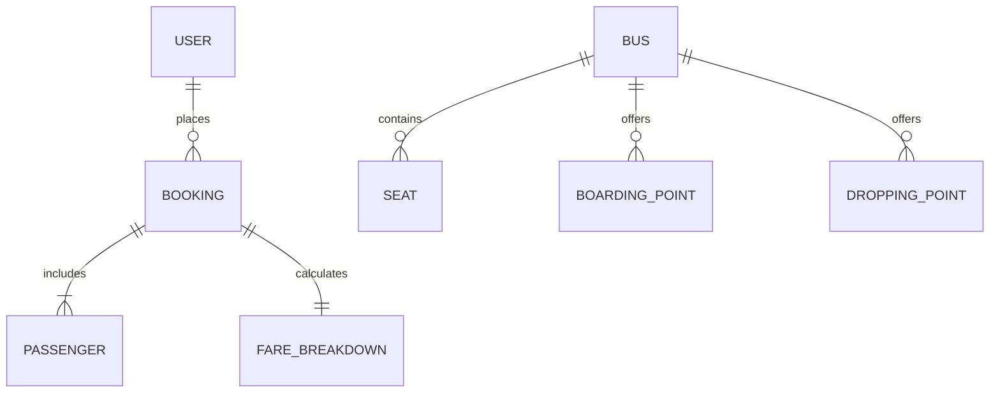

# Database Documentation — Safar Bus Reservation Platform

---

## 1. Database Architecture & Storage Engine

The **Safar** platform utilizes a client-side relational storage engine implemented over the browser's **Web Storage API** (`localStorage` and `sessionStorage`). The engine provides schema enforcement, relational foreign-key lookups, primary key generation, and atomic persistence.

```text
Web Storage Subsystem
├── LocalStorage (Permanent Relational Store)
│   ├── safar_users              [User Accounts Collection]
│   ├── safar_bookings           [Bookings & Tickets Collection]
│   ├── safar_current_user       [Active Auth Session Token]
│   └── safar_recent_searches    [Search History Array]
└── SessionStorage (Ephemeral Transaction Buffer)
    ├── safar_search_params      [Origin, Destination, Date]
    ├── safar_selected_seats     [Active Seat Selection Map]
    ├── safar_checkout_bus       [Staged Bus Entity]
    ├── safar_checkout_form      [In-Progress Passenger Manifest]
    └── safar_confirmed_booking  [Active Boarding Pass Receipt]
```

---

## 2. Entity-Relationship (ER) Model

The complete data model is visualized in [`docs/diagrams/database-er.png`](file:///c:/Users/Windows/Documents/BUS/docs/diagrams/database-er.png):



---

## 3. Entity Schema Definitions

### 3.1 Collection: `safar_users`
Stores registered passenger accounts.
- **Key**: `'safar_users'`
- **Data Type**: `Array<UserEntity>`

| Field | Type | Constraint | Description |
|---|---|---|---|
| `email` | `string` | **Primary Key** | User's unique email address (lowercased on query). |
| `password` | `string` | Required | Plaintext password (simulated authentication). |
| `name` | `string` | Required, min 3 chars | Full name of the user. |
| `phone` | `string` | Required, 10 digits | Mobile contact number. |
| `gender` | `string` | Optional | User gender (`'Male'`, `'Female'`, `'Other'`). |
| `age` | `number \| string`| Optional, 1–120 | Age in years. |

---

### 3.2 Collection: `safar_bookings`
Stores confirmed and historical travel reservations.
- **Key**: `'safar_bookings'`
- **Data Type**: `Array<BookingEntity>`

| Field | Type | Constraint | Description |
|---|---|---|---|
| `id` | `string` | **Primary Key** | Unique booking reference (`"BK-xxxxxx"`). |
| `userEmail` | `string` | **Foreign Key** | Matches `safar_users.email`. |
| `busId` | `string` | Required | Deterministic bus identifier (e.g. `"bus-1428-0"`). |
| `operatorName` | `string` | Required | Travel brand (e.g. `"Safar Luxe Class"`). |
| `busType` | `string` | Required | Category (e.g. `"A/C Sleeper (2+1)"`). |
| `fromCity` | `string` | Required | Origin transit terminal city. |
| `toCity` | `string` | Required | Destination arrival terminal city. |
| `travelDate` | `string` | Required, ISO date | Departure date (`"YYYY-MM-DD"`). |
| `departureTime`| `string` | Required, HH:mm | Scheduled departure in 24h format. |
| `arrivalTime` | `string` | Required, HH:mm | Scheduled arrival in 24h format. |
| `seatsSelected`| `string[]`| Required, 1–6 items| Array of seat numbers (e.g. `["L4", "L5"]`). |
| `passengers` | `Passenger[]`| Required | Array of passenger objects. |
| `fareDetails` | `FareObject` | Required | Itemized financial receipt object. |
| `paymentMethod`| `string` | Required | Method used (`'UPI'`, `'Card'`, `'NetBanking'`). |
| `status` | `string` | Enum | `'Upcoming'`, `'Completed'`, `'Cancelled'`. |
| `createdAt` | `string` | ISO timestamp | Booking timestamp in UTC. |
| `cancelledAt` | `string` | Optional ISO timestamp | Cancellation timestamp in UTC. |

---

### 3.3 Embedded Object: `passengers`
- **Parent**: `BookingEntity.passengers`
- **Structure**:
```json
{
  "name": "Arun Kumar",
  "age": 28,
  "gender": "Male",
  "seatNo": "L4"
}
```

---

### 3.4 Embedded Object: `fareDetails`
- **Parent**: `BookingEntity.fareDetails`
- **Structure**:
```json
{
  "baseFare": 1900,
  "convenienceFee": 40,
  "taxes": 95,
  "discount": 150,
  "totalFare": 1885
}
```

---

## 4. Procedural Entity Schemas (In-Memory Inventory)

### 4.1 Bus Entity (`buses.js`)
Generated deterministically per route query:
```json
{
  "id": "bus-1428-0",
  "operatorName": "Safar Luxe Class",
  "operatorRating": 4.8,
  "reviewsCount": 342,
  "logoColor": "var(--brand-primary)",
  "busType": "A/C Sleeper (2+1)",
  "isAC": true,
  "isSleeper": true,
  "departureTime": "21:00",
  "arrivalTime": "05:30",
  "duration": "8h 30m",
  "durationMinutes": 510,
  "price": 950,
  "availableSeats": 18,
  "totalSeats": 30,
  "amenities": ["Wi-Fi", "USB Charging Port", "Water Bottle", "Blanket"],
  "boardingPoints": [ ... ],
  "droppingPoints": [ ... ],
  "seats": [ ... ],
  "fromCity": "Chennai",
  "toCity": "Bengaluru",
  "travelDate": "2026-09-15"
}
```

### 4.2 Seat Entity
```json
{
  "seatNo": "L4",
  "deck": "Lower",
  "type": "Sleeper",
  "row": 2,
  "column": "Left",
  "isWindow": true,
  "isBooked": false,
  "isLadies": false,
  "priceMultiplier": 1.0
}
```

---

## 5. Storage Lifecycle & Data Integrity

1. **Initialization**: On application load, `mockDb.js` evaluates `localStorage.getItem('safar_users')` and `localStorage.getItem('safar_bookings')`. If null, default records are seeded.
2. **Read Operations**: Queries deserialize JSON strings into typed object collections, using lowercased email matching for case-insensitive lookup.
3. **Write Operations**: Mutation functions (`addBooking`, `registerUser`, `updateProfile`, `cancelBooking`) execute synchronous `setItem` transactions, ensuring data durability across window closures and device reboots.
4. **Purging & Cleanup**: When a user logs out, `safar_current_user` and `safar_checkout_form` are destroyed while user history in `safar_users` and `safar_bookings` remains intact.
