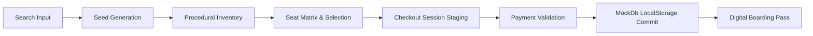

# System Architecture — Safar Bus Reservation Platform

---

## 1. Architectural Overview

The **Safar** bus reservation platform adopts a modern, decoupled **Client-Centric Single Page Architecture (SPA)**. Built with React 19, the application operates as an autonomous, self-contained client-side system capable of dynamic procedural inventory generation, transactional state management, and relational data simulation without relying on an external backend API server.

```text
┌──────────────────────────────────────────────────────────────────────────────┐
│                       PRESENTATION TIER (Browser UI)                         │
│  React 19 VDOM · Hash Router · Reusable UI Components · CSS Variable Tokens   │
└──────────────────────────────────────┬───────────────────────────────────────┘
                                       │ State & Event Dispatch
┌──────────────────────────────────────▼───────────────────────────────────────┐
│                    STATE & SESSION COORDINATION TIER                         │
│  React Hooks (useState, useCallback, useMemo) · sessionStorage Session Buffer│
└──────────────────────────────────────┬───────────────────────────────────────┘
                                       │ Procedural Generation & Verification
┌──────────────────────────────────────▼───────────────────────────────────────┐
│                      BUSINESS LOGIC & ENGINE TIER                            │
│  Deterministic Seed Engine · Seat Matrix Generator · Fare & Tax Calculator   │
│         Coupon Rule Evaluator · Payment Validation Engine                    │
└──────────────────────────────────────┬───────────────────────────────────────┘
                                       │ CRUD & Data Persistence
┌──────────────────────────────────────▼───────────────────────────────────────┐
│                     PERSISTENCE TIER (MockDb API)                            │
│   mockDb Interface · Web Storage API (localStorage) · JSON Entity Store       │
└──────────────────────────────────────────────────────────────────────────────┘
```

---

## 2. Multi-Tier Decomposition

### Tier 1: Presentation Layer
The presentation tier is structured into modular, declarative React components styled with custom CSS variables (`--brand-primary: #1e3a8a`, `--brand-accent: #0284c7`, etc.):
- **Root Layout Shell** (`App.jsx`): Provides the top-level grid containing `Navbar`, the dynamic main view, `Footer`, and global `Toast` notification dispatcher.
- **Page Views** (`src/pages/`):
  - `Home.jsx`: Hero discovery, recent search chips, popular routes, and value propositions.
  - `SearchResults.jsx`: Inventory listing, dynamic multi-facet filtering, and sorting controls.
  - `Checkout.jsx`: Multi-passenger form, boarding point selector, coupon input, and payment orchestration.
  - `BookingConfirmation.jsx`: Boarding pass presentation and post-booking actions.
  - `Dashboard.jsx`: Trip management tabbed interface (Upcoming, Completed, Cancelled, Profile).
  - `Auth.jsx`: Tabbed user authentication modal (Login / Registration) with demo prefill helpers.
  - `Help.jsx`: Refund policy guidelines and interactive FAQ accordions.
- **Component Primitives** (`src/components/`): Reusable UI units including `BusCard`, `SeatMap`, `PassengerForm`, `PaymentForm`, `FareSummary`, `CouponSection`, `Ticket`, and vector `Icon`.

### Tier 2: State & Session Coordination Layer
The application maintains two tiers of state to achieve instantaneous UI updates while preventing data loss:
1. **In-Memory Component State**: Managed via React 19 hooks (`useState`, `useCallback`, `useMemo`), driving immediate VDOM re-renders for seat toggling, tab switching, and input validation.
2. **Session Storage Buffer (`sessionStorage`)**: Acts as a resilient transaction staging area:
   - `safar_search_params`: Preserves origin, destination, and travel date across page reloads.
   - `safar_selected_seats`: Caches currently selected berths per bus ID so seat selections persist if a user logs in mid-flow.
   - `safar_checkout_bus`: Preserves the active bus entity selected for booking.
   - `safar_checkout_form`: Temporarily saves in-progress passenger names, ages, and contact details.
   - `safar_confirmed_booking`: Holds the most recently confirmed booking object to render the confirmation screen immediately.

### Tier 3: Business Logic & Procedural Engine Tier
Rather than relying on static mock JSON files or external network endpoints, Safar utilizes deterministic procedural generation:
- **Seed Hashing** (`hashSeed(str)`): Converts route and date strings (e.g., `"Chennai-Bengaluru-2026-09-15"`) into an integer seed via character code aggregation.
- **Procedural Bus Synthesizer** (`getBusesForRoute()`): Derives 5 to 8 realistic bus services per route, deterministically computing departure times, travel duration variations, base fares, operator ratings, and amenity combinations.
- **Dynamic Seat Allocator** (`generateSeatMatrix()`): Constructs 30-seat sleeper (Lower/Upper decks) or 40-seat seater (2+2 layout) matrices. Pre-existing bookings and ladies-priority berths are scattered deterministically using prime modulo formulas, ensuring identical layouts on page refresh while varying across different buses.
- **Fare & Tax Engine** (`calculateFare()`): Computes `baseFare = basePrice * seatsCount`, fixed convenience fees (₹40), 5% GST (`Math.round(baseFare * 0.05)`), and applies active discounts.
- **Promotion & Discount Evaluator** (`calculateDiscount()`): Validates coupon eligibility against user booking history (`FIRSTTRIP`), travel date day-of-week (`WEEKEND`), and minimum spend thresholds (`ROUTE10`).

### Tier 4: Persistence Tier (`mockDb.js`)
Simulates a relational database engine atop browser `localStorage`:
- **Entity Collections**:
  - `safar_users`: Stores user profiles with hashed/plain passwords, emails (primary key), names, phone numbers, and demographics.
  - `safar_bookings`: Stores booking records indexed by unique ID (`BK-xxxxxx`), linked to user email foreign keys.
  - `safar_current_user`: Tracks the active authentication session.
- **Relational Integrity**: Enforces unique email constraints on registration, filters bookings by user email, and updates booking statuses atomically during cancellations.

---

## 3. Hash-Based Client Routing & Navigation

Safar implements a custom lightweight hash router (`#/`, `#/search`, `#/checkout`, `#/confirmation`, `#/auth`, `#/dashboard`, `#/help`):

```text
User Action / URL Hash Change
         │
         ▼
window.onhashchange Event Listener
         │
         ▼
pageFromHash() Normalization
         │
         ▼
Route Guards Evaluation (effectivePage)
  ├── dashboard && !currentUser    --> redirect to 'auth'
  ├── checkout && !checkoutBus     --> redirect to 'search'
  └── confirmation && !confirmedBooking --> redirect to 'home'
         │
         ▼
history.replaceState() Hash Synchronization
         │
         ▼
App.jsx renderPage() Switcher
```

### Advantages of Hash Routing in Safar
1. **Zero Server Dependency**: Operates flawlessly across static hosting environments (GitHub Pages, S3, Netlify, local file preview) without requiring server-side fallback rewrites (e.g., Apache `.htaccess` or Nginx `try_files`).
2. **Native Browser History Support**: Fully supports browser Back and Forward navigation buttons without page reloads.
3. **Route Guard Enforcement**: Prevents broken UI states by rerouting unauthorized or uninitialized views while maintaining URL honesty via `history.replaceState`.

---

## 4. End-to-End Data Flow Architecture

The data flow spans six distinct phases, visualized in detail in [`docs/diagrams/data-flow.png`](file:///c:/Users/Windows/Documents/BUS/docs/diagrams/data-flow.png):



1. **Discovery Phase**: User inputs origin and destination cities with a travel date.
2. **Synthesis Phase**: The engine hashes inputs into a deterministic seed, deriving schedule, duration, operators, amenities, and seat layout.
3. **Selection Phase**: Passenger toggles berths in the interactive 2D deck matrix; state updates the local selection map and recalculates live fare totals.
4. **Staging Phase**: Passenger data and contact details are persisted to `sessionStorage` (`safar_checkout_form`), ensuring resilience against refresh.
5. **Validation Phase**: Payment inputs undergo validation (Luhn check for cards, regex pattern matching for UPI).
6. **Persistence & Issuance Phase**: A new booking record (`BK-xxxxxx`) is appended to `localStorage`, checkout buffers are purged, and a printable boarding pass ticket is rendered.

---

## 5. Architectural Quality Attributes

| Quality Attribute | Architectural Tactic | Verified Implementation |
|---|---|---|
| **Performance** | Tree-shaken ESM modules & zero CSS runtime | Vite bundle of 292.88 kB JS (84.32 kB gzip) and 44.04 kB CSS (8.60 kB gzip). |
| **Durability** | Dual-tier storage (sessionStorage + localStorage) | In-progress forms survive page refresh; bookings persist across browser restarts. |
| **Maintainability** | Clean component separation & centralized data utils | Clear module boundaries between pages, presentation components, data, and utilities. |
| **Accessibility (a11y)** | Semantic HTML5 & ARIA states | Buttons feature `aria-expanded`, seat buttons include descriptive labels and keyboard triggers. |
| **Deterministic Reliability** | Algorithmic pseudorandom generation with seed | Search results for a given route and date are 100% reproducible across reloads. |
